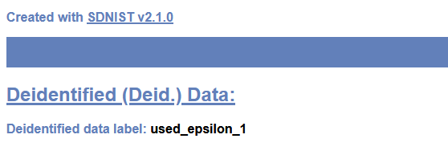
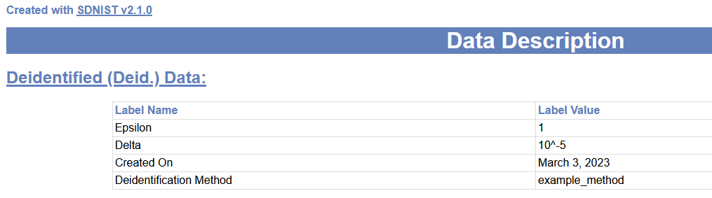

# SDNist v2.3: Deidentified Data Report Tool

## [SDNist is the offical software package for engaging in the NIST Collaborative Research Cycle](https://pages.nist.gov/privacy_collaborative_research_cycle)

Welcome! SDNist is a python package that provides benchmark data and evaluation metrics for deidentified data generators. This version of SDNist supports using the [NIST Diverse Communities Data Excerpts](https://github.com/usnistgov/SDNist/tree/main/nist%20diverse%20communities%20data%20excerpts), a geographically partioned, limited feature data set.

The deidentified data report evaluates utility and privacy of a given deidentified dataset and generates a summary quality report with performance of a deidentified dataset enumerated and illustrated for each utility and privacy metric.

[Preview sample reports produced by the tool here.](https://github.com/usnistgov/SDNist/tree/main/sdnist/report/sample-reports)

This tool is being actively developed. Please (raise an Issue)[https://github.com/usnistgov/SDNist/issues]  if you catch a bug or would like have feature suggestions. 


### Project Team  
**Karan Bhagat**, *Knexus Research* - Developer *sdnist.report* package  

**Christine Task**, *Knexus Research* - Project technical lead

**Gary Howarth**, *NIST* - Project PI [gary.howarth@nist.gov](mailto:gary.howarth@nist.gov)

### Acknowledgements

SDNist v2 grew from [SDNist v1](https://github.com/usnistgov/Differential-Privacy-Temporal-Map-Challenge-assets), developed in partnership with Saurus Technologies under CRADA CN-21-0143.

### Reporting Issues
Help us improve the package and this guide by reporting issues [here](https://github.com/usnistgov/SDNist/issues).

### Temporal Map Challenge Environment

SDNist v2.0 and above does not support the Temporal Map Challenge environment.

To run the testing environment from the [*NIST PSCR Differential Privacy Temporal Map Challenge*](https://www.nist.gov/ctl/pscr/open-innovation-prize-challenges/past-prize-challenges/2020-differential-privacy-temporal) for the Chicago Taxi data sprint or the American Community Survey sprint, please go to the the [Temporal Map Challenge assets repository](https://github.com/usnistgov/Differential-Privacy-Temporal-Map-Challenge-assets).


Setting Up the SDNIST Report Tool
------------------------

### Brief Setup Instructions

SDNist requires Python version 3.7 or greater. If you have installed a previous version of the SDNist library, we recommend installing v2.3 in a virtual environment. v2.3 can be installed via [Release 2.3](https://github.com/usnistgov/SDNist/releases/tag/v2.3.0) or via the Pypi server: `pip install sdnist` or, if you already have a version installed, `pip install --upgrade sdnist`.

The NIST Diverse Community Exceprt data will download on the fly.


### Detailed Setup Instructions Using Pypi

1. The SDNist Report Tool is a part of the sdnist Python library that can be installed on a user’s MAC OS, Windows, or Linux machine.


2. The sdnist library requires Python version 3.7 or greater to be installed on the user's machine. Check whether an installation exists on the machine by executing the following command in your terminal on Mac/Linux or powershell on Windows:
   ```
    c:\\> python -V
   ```
    If Python is already installed, the above command should return the currently installed version. If Python is not found or the version is below 3.7, then you can download Python from the [Python website](https://www.python.org/downloads/).


3.  Create a local directory/folder on the machine to set up the SDNist library. This guide assumes the local directory to be sdnist-project; an example of a complete file path is c:\\sdnist-project:
    ```
    c:\\sdnist-project>     
    ```


4. In the already-opened terminal or powershell window, execute the following command to create a new Python environment. The sdnist library will be installed in this newly created Python environment:

    ```
    c:\\sdnist-project> python -m venv venv
    ```

5. The new Python environment will be created in the sdnist-project directory, and the files of the environment should be in the venv directory. To check whether a new Python environment was created successfully, use the following command to list all directories in the sdnist-project directory, and make sure the venv directory exists.

    **MAC OS/Linux:**
    ```
    sdnist-project> ls
    ```
    **Windows:**
    ```
    c:\\sdnist-project> dir
    ```

6. Now activate the Python environment and install the sdnist library into it.

    **MAC OS/Linux:**
    ```
    sdnist-project> . venv/bin/activate
    ```
    The python virtual environment should now be activated. You should see environment name (**venv** in this case) appended to the terminal prompt as below:  
    ```
    (venv) sdnist-project>
    ```

    **Windows:**
    ```
    c:\\sdnist-project> . venv/Scripts/activate
    ```
    The python virtual environment should now be activated. You should see environment name (**venv** in this case) appended to the command/powershell prompt as below:  
    ```
    (venv) c:\\sdnist-project>
    ```

    On Windows, a few users may encounter the following error if their machines are new (executing scripts is disabled by default on some Windows machines):
    ```
    C:\\sdnist-project\\venv\\Scripts\\Activate.ps1 cannot be loaded because running scripts is disabled on this system.
    ```
    Run the following command to let Windows execute scripts:
    ```
    Set-ExecutionPolicy -ExecutionPolicy RemoteSigned -Scope LocalMachine
    ```

7. Install sdnist Python library:
       ```
       (venv) c:\\sdnist-project> pip install sdnist
       ```

8. Installation is successful if executing the following command outputs a help menu for the sdnist.report package:
       ```
       (venv) c:\\sdnist-project> python -m sdnist.report -h
       ```
       Output:
       ```
        usage: __main__.py [-h] [--labels LABELS] [--data-root DATA_ROOT]
                           PATH_DEIDENTIFIED_DATASET TARGET_DATASET_NAME
        
        positional arguments:
          PATH_DEIDENTIFIED_DATASET
                                Location of deidentified dataset (csv or parquet
                                file).
          TARGET_DATASET_NAME   Select name of the target dataset that was used to
                                generated given deidentified dataset.
        
        options:
          -h, --help            show this help message and exit
          --labels LABELS       This argument is used to add meta-data to help
                                identify which deidentified data was was evaluated in
                                the report. The argument can be a string that is a
                                plain text label for the file, or it can be a file
                                path to a json file containing [label, value] pairs.
                                This labels will be included in the printed report.
          --data-root DATA_ROOT
                                Path of the directory to be used as the root for the
                                target datasets.
        
        Choices for Target Dataset Name:
          [DATASET NAME]        [FILENAME]
          MA                    ma2019
          TX                    tx2019
          NATIONAL              national2019
       ```

9. These instructions install sdnist into a virtual environment. The virtual environment must be activated (step 9) each time a new terminal window is used with sdnist.


Generate Data Quality Report
---------------------------

1.  The sdnist.report package requires a path to the deidentified dataset file and the name of the target dataset from which the deidentified dataset file will be created. Following is the command line usage of the sdnist.report package:
      ```
      python -m sdnist.report PATH_DEINDETIFIED_DATASET TARGET_DATSET_NAME
      ```

      The above command is just an example usage signature of the package. Steps 3 through 5 show the actual commands to run the tool, where the parameter PATH_DEIDENTIFIED_DATASET is replaced with the path of the deidentified dataset file on the your machine, and the parameter TARGET_DATASET_NAME is replaced with one of the bundled dataset names (MA, TX, or NATIONAL).

      A deidentified dataset file can be anywhere on your machine. You only need the path of the file to pass it as an argument to the sdnist.report package. For illustration purposes, this guide assumes an example deidentified dataset file named syn_tx.csv is generated from the bundled dataset file named TX that is present in the sdnist-project directory. You can also use the bundled toy deidentified datasets for generating some toy evaluation reports using the sdnist.report package by following steps 5 and 6 in the next section, Setup Data for SDNIST Report Tool.

     The sdnist.report packages come bundled with three target datasets: MA, TX, and NATIONAL. If these datasets are not available locally, the package will download them automatically when you run any one of the commands in steps 3 through 5 for the first time. In case of any trouble while downloading the datasets, please refer to the next section, Setup Data for SDNIST Report Tool.


2.  If you have closed the terminal or the powershell window that was used for the tool setup, open a new one, and after navigating the to sdnist-project directory, run the activate script as explained in step 9 of the Setup SDNIST Report Tool section.


3.  Use the following command to generate a data quality report for the example deidentified dataset (syn_tx.csv) that is generated using the bundled dataset TX:
      ```
      (venv) c:\\sdnist-project> python -m sdnist.report syn_tx.csv TX
      ```
      At the completion of the process initiated by the above command, an .html report will open in the default web browser on your machine. Likewise, .html report files will be available in the reports directory created automatically in the sdnist-project directory.


4.  Use the following command to generate a data quality report for the example deidentified dataset (syn_ma.csv) that is generated using the bundled dataset MA:
      ```
      (venv) c:\\sdnist-project> python -m sdnist.report syn_ma.csv MA
      ```


5.  Use the following command to generate a data quality report for the example deidentified dataset (syn_national.csv) that is generated using the bundled dataset NATIONAL:
      ```
      (venv) c:\\sdnist-project> python -m sdnist.report syn_national.csv NATIONAL
      ```
6.  Starting from version 2.1, SDNist allow users to add labels for the deidentified dataset used to generate report:
    * To add single string label to the report, use command line option **--labels** followed by a string as given in the following example command:
      ```
      (venv) c:\\sdnist-project> python -m sdnist.report syn_national.csv NATIONAL --labels used_epsilon_1
      ```
      This is how the string label *used_epsilon_1* will appear in the report:
      
    * To add multiple string labels to the report, use command line option **--labels** followed by a path to the json file containing labels:
      ```
      (venv) c:\\sdnist-project> python -m sdnist.report syn_national.csv NATIONAL --labels example_labels.json
      ```
      Where example_labels.json can be:
      ```
        {
          "epsilon": "1",
          "delta": "10^-5",
          "created on": "March 3, 2023",
          "deidentification method": "example_method"
        }
      ```
      This is how the *example_labels.json* will appear in the report:
     
7.  The following are all the parameters offered by the sdnist.report package:

     - **PATH_DEIDENTIFIED_DATASET**: The absolute or relative path to the deidentified dataset .csv or parquet file. If the provided path is relative, it should be relative to the current working directory. This guide assumes the current working directory is sdnist-project.
     - **TARGET_DATASET_NAME**: This should be the name of one of the datasets bundled with the sdnist.report package. It is the name of the dataset from which the input deidentified dataset is generated, and it can be one of the following:
       - MA
       - TX
       - NATIONAL

     - **--data-root**: The absolute or relative path to the directory containing the bundled dataset, or the directory where the bundled dataset should be downloaded to if it is not available locally. The default directory is set to **diverse_community_excerpts_data**.
     - **--labels**: This argument is used to add meta-data to help identify which deidentified data was was evaluated in the report.  The argument can be a string that is a plain text label for the file, or it can be a file path to a json file containing label, value pairs. 

Setup Data for SDNIST Report Tool
---------------------------------

1.  The sdnist.report package comes with built-in datasets. The package will automatically download the datasets from Github if they are not already available locally on your machine. You should see following message on your terminal or powershell window when the datasets are downloaded by the sdnist.report package:
      ```
      (venv) c:\\sdnist-project> python -m sdnist.report syn_tx.csv TX

      Downloading all SDNist datasets from:  
      https://github.com/usnistgov/SDNist/releases/download/v2.2.0/diverse_communities_data_excerpts.zip ...  
      ...5%, 47352 KB, 8265 KB/s, 5 seconds elapsed
      ```

      Follow the next subsection, Download Data Manually, if the sdnist.report package is unable to download the datasets.


2. All the datasets required by the sdnist.report package are installed into the sdnist \_toy \_data directory, which should be now present inside the sdnist-project directory. sdnist \_toy \_data is also a data root directory. You can use some other directory as a data root by providing the –data-root argument to the sdnist.report package. If you provide a –data-root argument with a path, the sdnist.report package will look for datasets in the data root directory you have specified, and the package will download it if it is not present in the data root.


3. The sdnist.report package also needs a deidentified dataset that it can evaluate against its original counterpart. Since the sdnist.report package comes bundled with the datasets, the deidentified dataset should be generated using the bundled datasets.

   You can download a copy of the datasets from Github [Diverse Communities Data Excerpts](https://github.com/usnistgov/SDNist/tree/main/nist%20diverse%20communities%20data%20excerpts). This copy is similar to the one bundled with the sdnist.report package, but it contains more documentation and a description of the datasets.


4. You can download the toy deidentified datasets from Github [Sdnist Toy Deidentified Dataset](https://github.com/usnistgov/SDNist/releases/download/v2.1.1/toy_deidentified_data.zip). Unzip the downloaded file, and move the unzipped toy_deidentified_dataset directory to the sdnist-project directory.


5. Each toy deidentified dataset file is generated using the [Diverse Communities Data Excerpts](https://github.com/usnistgov/SDNist/releases/download/v2.3.0/diverse_communities_data_excerpts.zip). The syn_ma.csv, syn_tx.csv, and syn_national.csv deidentified dataset files are created from target datasets MA (ma2019.csv), TX (tx2019.csv), and NATIONAL(national2019.csv), respectively. You can use one of the toy deidentified dataset files for testing whether the sdnist.report package is installed correctly on your system.


6. Use the following commands for generating reports if you are using a toy deidentified dataset file:

   For evaluating the Massachusetts dataset:
   ```
   (venv) c:\\sdnist-project> python -m sdnist.report toy_deidentified_data/syn_ma.csv MA
   ```

   For evaluating the Texas dataset:
   ```
   (venv) c:\\sdnist-project> python -m sdnist.report toy_deidentified_data/syn_tx.csv TX
   ```

   For evaluating the national dataset:
   ```
   (venv) c:\\sdnist-project> python -m sdnist.report toy_deidentified_data/syn_national.csv NATIONAL
   ```

7.  A deidentified dataset can be a .csv or a parquet file, and the path of this file is required
by the sdnist.report package to generate a data quality report.


Download Data Manually
----------------------

1.  If the sdnist.report package is not able to download the datasets, you can download them from Github [Diverse Communities Data Excerpts](https://github.com/usnistgov/SDNist/releases/download/v2.3.0/diverse_communities_data_excerpts.zip).
3.  Unzip the **diverse_community_excerpts_data.zip** file and move the unzipped **diverse_community_excerpts_data** directory to the **sdnist-project** directory.
4.  Delete the **diverse_community_excerpts_data.zip** file once the data is successfully extracted from the zip.

Citing SDNist Deidentified Data Report Tool
-------------------------------------------

If you publish work that utilizes the SDNist Deidentified Data Tool, please cite the software. Citation recommendation:  
> Task C., Bhagat K., and Howarth G.S. (2023), SDNist v2: Deidentified Data Report Tool, 
> National Institute of Standards and Technology, 
> https://doi.org/10.18434/mds2-2943.

Credits 
----------

- [Christine Task](mailto:christine.task@knexusresearch.com) - Project technical lead - christine.task@knexusresearch.com
- [Karan Bhagat](https://github.com/kbtriangulum) - Contributor
- [David Lee](https://www.linkedin.com/in/david-lee-13872922/) - Documentation
- [Gary Howarth](https://www.nist.gov/people/gary-howarth) - Project PI - gary.howarth@nist.gov