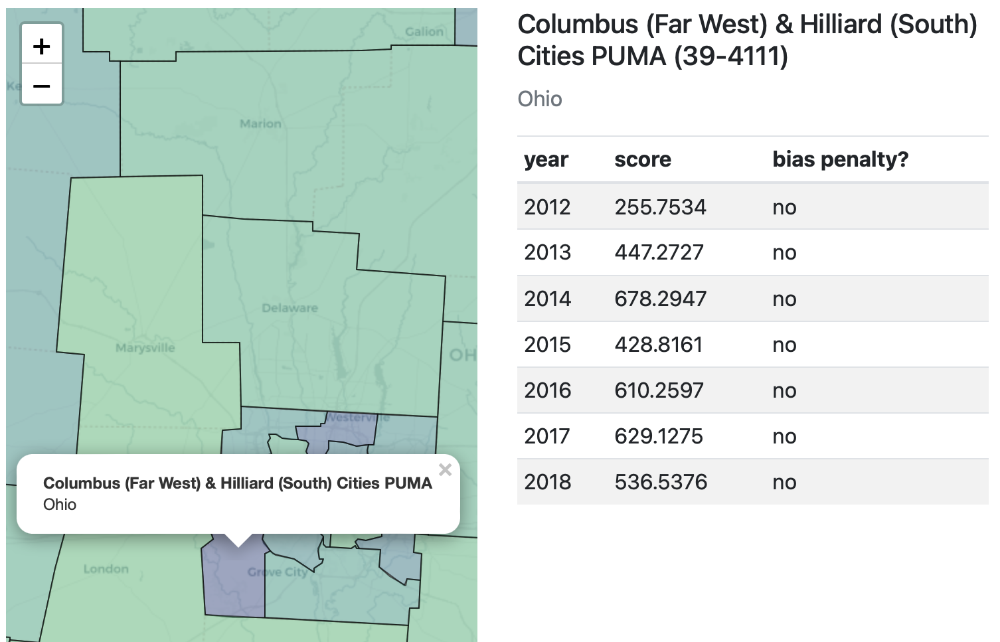

# SDNist: Benchmark data and evaluation tools for data synthesizers.

This package provides tools for standardized and reproducible comparison of synthetic generator models on real-world data and use cases. Both datasets and metrics were developed for and vetted through the [*NIST PSCR Differential Privacy Temporal Map Challenge*](https://www.nist.gov/ctl/pscr/open-innovation-prize-challenges/current-and-upcoming-prize-challenges/2020-differential.).

## Quick introduction

You have two possible workflows:
1) manually manage the public and private datasets as `pandas.DataFrame` objects, directy generate your synthetic data and directly compute the score
2) reproduce the setup of the challenge, i.e create a synthetizer subclass of `challenge.submission.Model` then call `run(model, challenge="census")`. This makes sure your synthetizer is scored against the same datasets as in the challenge.

In all cases, the scoring does not numerically check whether your synthesizer is actually $\epsilon$-differentially private or not. You have to provide a formal proof yourself.

## Installation

Requirements:  [Python >=3.6](https://www.python.org/downloads/)

The SDNist source code is hosted on Github and data tables will be downloaded as needed from the [NIST Data Repository](https://data.nist.gov/od/id/mds2-2515).
Alternatively, the data can be downloaded as part of [SDNist Release 1.2.0](https://github.com/usnistgov/SDNist/releases/tag/v1.2.0)

- Install via `pip` from [PyPi](https://pypi.org/) directory:

```
pip install sdnist
```

- Install `sdnist` Python module through git repository:
```
git clone https://github.com/usnistgov/SDNist && cd SDNist
pip install .
```

- Install `sdnist` Python module through git in a virtual environment:

```
git clone https://github.com/usnistgov/SDNist && cd SDNist
python3 -m venv venv
. venv/bin/activate
pip install .
```

## Contributions

This repository is being actively developed, and we welcome contributions.

If you encounter a bug, [please create an issue](https://github.com/usnistgov/SDNist/issues/new).

Please feel free to create a Pull Request to help us correct bugs and other issues.

Please contact us if you wish to augment or expand existing features.  


## Examples

### 1) Quickest example (option 1)
#### Loading and scoring

```
>>> import sdnist

>>> dataset, schema = sdnist.census()  # Retrieve public dataset
>>> dataset.head()
      PUMA  YEAR   HHWT  GQ  ...  POVERTY  DEPARTS  ARRIVES  sim_individual_id
0  17-1001  2012   88.0   1  ...      118      902      909                 12
1  17-1001  2012   61.0   1  ...      262      732      744                 33
2  17-1001  2012   54.0   1  ...      118      642      654                401
3  17-1001  2012  106.0   1  ...      262        0        0                470
4  17-1001  2012   31.0   1  ...      501        0        0                702
[5 rows x 36 columns]

>>> synthetic_dataset = dataset.sample(n=20000)  # Build a fake synthetic dataset

# Compute the score of the synthetic dataset
>>> sdnist.score(dataset, synthetic_dataset, schema, challenge="census")  
100%|███████████████████████████████████████████| 50/50 [00:04<00:00, 12.11it/s]
CensusKMarginalScore(847)
```

#### Discretizing a dataset
Many synthesizers require working on categorical/discretized data, yet many features of in `sdnist` datasets are actually
integer or floating point valued. `sdnist` provide a simple tool to discretize/undiscretize `sdnist` datasets.

First, note that the k-marginal score itself works on categorical data under the hood. For fairness, the bins that are used can be considered public. They are available at

```
>>> bins = sdnist.kmarginal.CensusKMarginalScore.BINS
```

for the ACS (American Community Survey) dataset or

```
>>> bins = sdnist.kmarginal.TaxiKmarginalScore.BINS
```

for the Chicago taxi dataset.

The `pd.DataFrame` datasets can then be discretized using

```
>>> dataset_binned = sdnist.utils.discretize(dataset, schema, bins)
```

`sdnist.utils.discretize` returns a `pd.DataFrame` where each value is remapped to `(0, n-1)` where `n` is the number of distinct values. Note that the even though the `score` functions should be given *unbinned* datasets, i.e if your synthesizer works on discretized dataset, you should first undiscretize your synthetic data. This can be done using

```
>>> synthetic_dataset_binned = ... # generate your synthetic data using your own method
>>> synthetic_dataset = sdnist.utils.undo_discretize(synthetic_dataset_binned, schema, bins)
```

### Directly computing the score on a given `.csv` file

You can directly run from a terminal

```
% python -m sdnist your_file.csv
```

This will score against the public census (ACS) dataset and display the result in an HTML page:  



Other options are available by calling `--help`.

### 2) Reproducing the baselines from the challenge by sublasscing `challenge.submission.Model` (option 2, slightly more advanced and time-consuming)

Some examples of subclasssing `challenge.submission.Model` are available in the library.

#### Subsample

Build a synthetic dataset by randomly subsampling 10% of the private dataset:

```
python -m sdnist.challenge.subsample
```

Output :

```
python -m sdnist.challenge.subsample
2021-11-23 14:55:07.889 | INFO     | sdnist.challenge.submission:run:66 - Skipping scoring for eps=0.1.
2021-11-23 14:55:07.889 | INFO     | sdnist.challenge.submission:run:73 - Resuming scoring from results/census/eps=1.csv.
2021-11-23 14:55:08.007 | INFO     | sdnist.challenge.submission:run:88 - Computing scores for eps=1.
100%|███████████████████████████████████████████| 50/50 [00:05<00:00,  9.37it/s]
2021-11-23 14:55:14.969 | SUCCESS  | sdnist.challenge.submission:run:92 - eps=1score=842.68
2021-11-23 14:55:14.985 | INFO     | sdnist.challenge.submission:run:79 - Generating synthetic data for eps=10.
2021-11-23 14:55:15.565 | INFO     | sdnist.challenge.submission:run:85 - (saved to results/census/eps=10.csv)
2021-11-23 14:55:15.565 | INFO     | sdnist.challenge.submission:run:88 - Computing scores for eps=10.
100%|███████████████████████████████████████████| 50/50 [00:05<00:00,  9.39it/s]
2021-11-23 14:55:22.530 | SUCCESS  | sdnist.challenge.submission:run:92 - eps=1score=842.42

```

Note that the resulting synthetic dataset is not differentillally private.

#### Random values

Build a synthetic dataset by chosing random valid values:

```
python -m sdnist.challenge.baseline
```

This corresponds to the baseline of the sprint 2 or the 2020 challenge. The output can be considered 0-differentially private if the schema itself is public.

Output:
```
2021-11-23 14:59:58.975 | INFO     | sdnist.challenge.submission:run:79 - Generating synthetic data for eps=0.1.
Generation: 100%|█████████████████████████████████| 20000/20000 [00:32<00:00, 608.57it/s]
2021-11-23 15:00:31.939 | INFO     | sdnist.challenge.submission:run:85 - (saved to results/census/eps=0.1.csv)
2021-11-23 15:00:31.939 | INFO     | sdnist.challenge.submission:run:88 - Computing scores for eps=0.1.
100%|████████████████████████████████████████████████████| 50/50 [00:05<00:00,  9.64it/s]
2021-11-23 15:00:38.664 | SUCCESS  | sdnist.challenge.submission:run:92 - eps=0.1	score=186.73
2021-11-23 15:00:38.682 | INFO     | sdnist.challenge.submission:run:79 - Generating synthetic data for eps=1.
Generation: 100%|█████████████████████████████████| 20000/20000 [00:34<00:00, 584.78it/s]
2021-11-23 15:01:12.962 | INFO     | sdnist.challenge.submission:run:85 - (saved to results/census/eps=1.csv)
2021-11-23 15:01:12.962 | INFO     | sdnist.challenge.submission:run:88 - Computing scores for eps=1.
100%|████████████████████████████████████████████████████████████████| 50/50 [00:05<00:00,  9.50it/s]
2021-11-23 15:01:19.818 | SUCCESS  | sdnist.challenge.submission:run:92 - eps=1	score=187.32
2021-11-23 15:01:19.835 | INFO     | sdnist.challenge.submission:run:79 - Generating synthetic data for eps=10.
Generation: 100%|█████████████████████████████████████████████| 20000/20000 [00:33<00:00, 596.94it/s]
2021-11-23 15:01:53.417 | INFO     | sdnist.challenge.submission:run:85 - (saved to results/census/eps=10.csv)
2021-11-23 15:01:53.417 | INFO     | sdnist.challenge.submission:run:88 - Computing scores for eps=10.
100%|████████████████████████████████████████████████████████████████| 50/50 [00:05<00:00,  9.94it/s]
2021-11-23 15:02:00.076 | SUCCESS  | sdnist.challenge.submission:run:92 - eps=10	score=186.73

```

### Other examples
Other examples are available in the `examples/` folder. The DPSyn and Minutemen are directly adapted from the public repo of their author:
- DPSyn : https://github.com/agl-c/deid2_dpsyn
- Minutemen : https://github.com/ryan112358/nist-synthetic-data-2021. This examples requires the `private-pgm` library (https://github.com/ryan112358/private-pgm)
